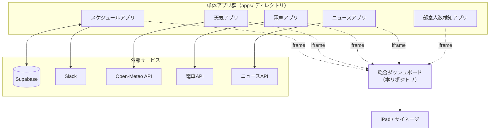

# DSC Dashboard

岡山大学DS部 総合ダッシュボードプロジェクト。部室の iPad（サイネージ）に常時表示する、全アプリ統合のダッシュボード本体。

## プロジェクトの狙い

- **運用目的**: 部室 iPad に常時表示するサイネージ。スケジュール・天気・電車・ニュース・部室人数を一画面に集約
- **教育的背景**: 新入生チームが単体アプリを「バイブコーディング（AI を活用した直感的開発）」で作り、それを統合して成功体験を積むための場
- **技術方針**: **pnpm workspaces によるモノレポ**。各アプリは `apps/` 以下の別ディレクトリに分離し、shadcn/ui コンポーネントは `packages/ui/` で共通化。Vercel マルチプロジェクトで各アプリを独立デプロイする

## 全体構成



## 統合方式

ダッシュボードと各アプリは **iframe による「メイン＆サイドバーレイアウト」** で統合する。JSON API 連携は行わない（各チームが作った UI をそのまま活かすため）。

- **画面レイアウト（7:3 分割）**
  - 左 70%: スケジュールアプリをメイン表示（スクロール禁止）
  - 右 30%: 天気・電車・ニュース・部室人数のミニウィジェットを縦に並べる
- **透過オーバーレイリンク**: ウィジェット側の `<iframe>` は `pointer-events: none`。カード全体を `<Link>` で囲み、タップで該当アプリの全画面ページへ遷移。`postMessage` は使わない
- **戻り導線**: 各アプリ右下の「ダッシュボードへ戻る」ボタンから `NEXT_PUBLIC_DASHBOARD_URL` で戻る

## アプリ一覧・URL 規約

| アプリ | 概要 | リポジトリ | ローカル | 本番URL |
|---|---|---|---|---|
| 総合ダッシュボード | 全アプリの統合表示 | このリポジトリ | `:3000` | `https://dsc-dashboard.vercel.app` |
| スケジュール | MTG 日程調整・部室利用状況 | [dsc_schedule](https://github.com/Shun523/dsc_schedule) | `:3001` | `https://dsc-schedule.vercel.app` |
| 天気 | 岡山の天気表示 | - | `:3002` | `https://dsc-weather.vercel.app` |
| 電車 | 電車時刻・遅延情報 | - | `:3003` | `https://dsc-transit.vercel.app` |
| ニュース | ニュースフィード | - | `:3004` | `https://dsc-news.vercel.app` |
| 部室人数検知 | 部室の現在の人数 | - | `:3005` | `https://dsc-occupancy.vercel.app` |

各アプリは `/widget`（埋め込み用・高さ 180px 固定・スクロール禁止）と `/`（全画面メイン）の 2 画面を必ず実装する。

## 技術スタック

- **フロントエンド**: Next.js 15 (App Router) + TypeScript (`strict: true`) + Tailwind CSS
- **UI**: shadcn/ui（デザイントークンは `--primary` / `--muted` 等を `globals.css` で共通化）
- **バックエンド**: Supabase（状態管理が必要なアプリのみ任意。必須ではない）
- **ホスティング**: Vercel（`main` への push で自動デプロイ）
- **実行環境**: Node.js 20 LTS（`.nvmrc` に明記）
- **表示デバイス**: iPad (Safari) / サイネージ

## セキュリティ方針（要点）

- ダッシュボードが埋め込む `<iframe>` には `sandbox="allow-scripts"` のみ付与（`allow-same-origin` / `allow-top-navigation` は禁止）
- ダッシュボード自身は `X-Frame-Options: DENY` と `Content-Security-Policy: frame-ancestors 'none'` でクリックジャック対策
- 各アプリの `/widget` は `frame-ancestors` を `NEXT_PUBLIC_DASHBOARD_URL` から **動的に生成**（ハードコード禁止。ローカルと本番で URL が異なるため）
- 外部 API 呼び出しは **Route Handler / Server Component 経由**。API キーを含む環境変数に `NEXT_PUBLIC_` を付けない
- HTTPS 必須（Vercel が自動付与）

## AI 駆動開発のルール

テンプレートリポジトリのルートに `GEMINI.md` / `.cursorrules` を配置し、以下を AI アシスタントへ絶対遵守させる：

- `components/ui/` は **編集・新規追加禁止**。独自部品は `components/features/`
- 色はテーマ変数（`text-primary` 等）のみ使用。`text-red-500` / `bg-[#ff0000]` のハードコード禁止
- 新規 npm パッケージ追加は **事前許可制**
- シークレットに `NEXT_PUBLIC_` を付けない

詳細とルール全文は [spec.md §4](./spec.md) を参照。

## iPad 運用

- ブラウザ: Safari（ダッシュボード URL をホーム画面に追加し、アイコン起動でアドレスバー非表示化）
- アクセスガイド（設定 → アクセシビリティ）でフルスクリーン固定
- 画面向き: 横向き／自動ロック: なし

## 開発

```bash
# Node.js 20 LTS を使用
nvm use

# 依存関係インストール（ルートで実行）
pnpm install

# 全アプリを一括起動（apps/* が並行起動）
pnpm dev

# 特定アプリのみ起動
pnpm --filter @dsc/weather dev

# 全アプリビルド / Lint
pnpm build
pnpm lint
```

各アプリの環境変数は `apps/<name>/.env.local` に設定：

```
NEXT_PUBLIC_DASHBOARD_URL=http://localhost:3000
```

> 本リポジトリは現状、仕様・計画ドキュメントのみで実装は未着手。`package.json` 追加後に上記コマンドが有効になる。

## ドキュメント

| ファイル | 役割 |
|---|---|
| [spec.md](./spec.md) | 要件定義・アーキテクチャ設計の **正本**。実装上の判断はここを参照 |
| [GUIDE.md](./GUIDE.md) | `spec.md` 各決定の「なぜ」を新入生向けに解説。技術解説・実装例 |
| [CLAUDE.md](./CLAUDE.md) | Claude Code 用ガイダンス（AI 駆動開発の逸脱防止） |
