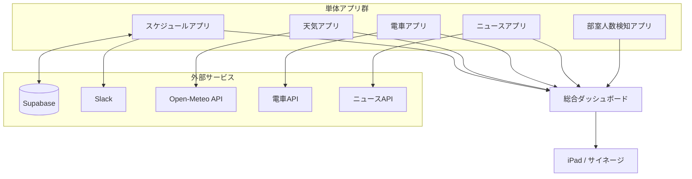

# DSC Dashboard

岡山大学DS部 総合ダッシュボードプロジェクト

## 全体構成

## アプリ一覧

| アプリ | 概要 | リポジトリ |
|---|---|---|
| スケジュールアプリ | MTG日程調整・部室利用状況 | [dsc_schedule](https://github.com/Shun523/dsc_schedule) |
| 天気アプリ | 岡山の天気表示 | - |
| 電車アプリ | 電車時刻・遅延情報 | - |
| ニュースアプリ | ニュースフィード | - |
| 部室人数検知アプリ | 部室の現在の人数 | - |
| 総合ダッシュボード | 全アプリの統合表示 | このリポジトリ |

## 技術スタック

- **フロントエンド**: Next.js 15 + TypeScript
- **スタイリング**: Tailwind CSS
- **バックエンド**: Supabase
- **表示デバイス**: iPad / サイネージ
